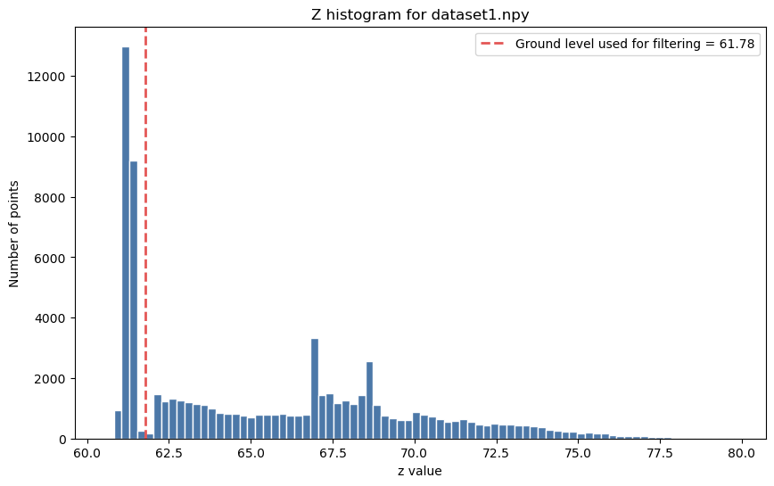
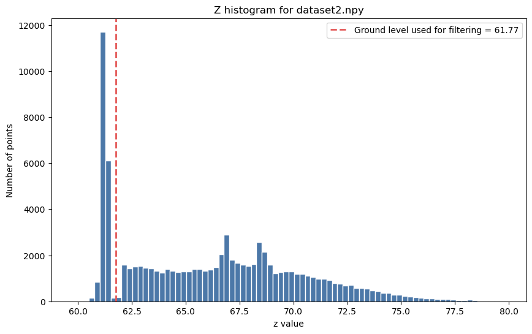
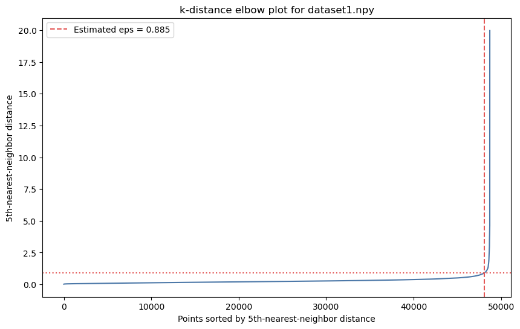
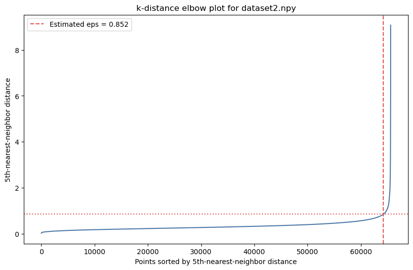
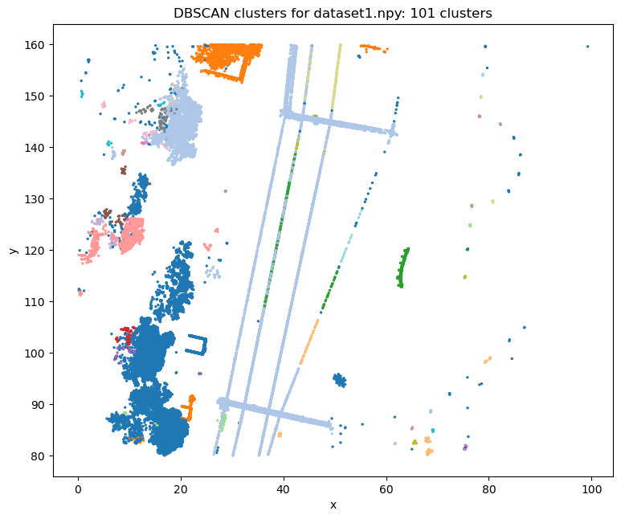
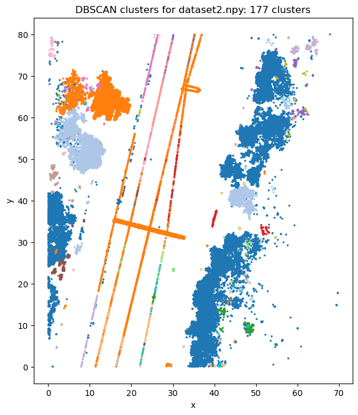
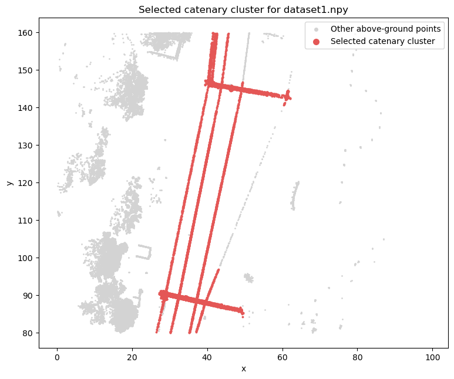
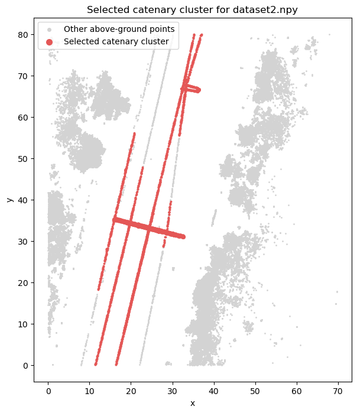

# Assignment 5 - LiDAR Processing

This project processes the two provided semi-processed LiDAR datasets:

- `dataset1.npy`
- `dataset2.npy`

Each dataset is a point cloud where every row contains `x`, `y` and `z` coordinates. The workflow follows the assignment tasks: ground-level estimation, DBSCAN tuning, and catenary-cluster extraction.

## Task 1 - Ground Level

The ground level was estimated from a histogram of the `z` values. The largest low-height peak represents the dense ground band. The selected ground-level value is used for filtering, so it is placed after the main ground peak to remove the full ground band.

| Dataset | Ground level used for filtering |
|---|---:|
| `dataset1.npy` | 61.78 |
| `dataset2.npy` | 61.77 |

### Histogram Plots

#### dataset1.npy

#### dataset2.npy

## Task 2 - Optimized DBSCAN eps

The optimized `eps` value was estimated with a 5-nearest-neighbor k-distance elbow plot. DBSCAN was then applied again using the selected `eps`, and the resulting clusters were checked visually.

| Dataset | Optimized eps | DBSCAN clusters excluding noise | Noise points |
|---|---:|---:|---:|
| `dataset1.npy` | 0.885 | 101 | 356 |
| `dataset2.npy` | 0.852 | 177 | 702 |

### Elbow Plots

#### dataset1.npy

#### dataset2.npy

### DBSCAN Cluster Plots

#### dataset1.npy

#### dataset2.npy

## Task 3 - Catenary Cluster

DBSCAN noise points were ignored. The likely catenary cluster was selected as the non-noise cluster with the largest combined `x/y` span:

`xy_span = (max_x - min_x) + (max_y - min_y)`

| Dataset | Catenary cluster label | min(x) | min(y) | max(x) | max(y) |
|---|---:|---:|---:|---:|---:|
| `dataset1.npy` | 7 | 26.498 | 80.019 | 62.140 | 159.907 |
| `dataset2.npy` | 21 | 11.393 | 0.053 | 37.007 | 79.976 |

### Catenary Cluster Plots

#### dataset1.npy

#### dataset2.npy

